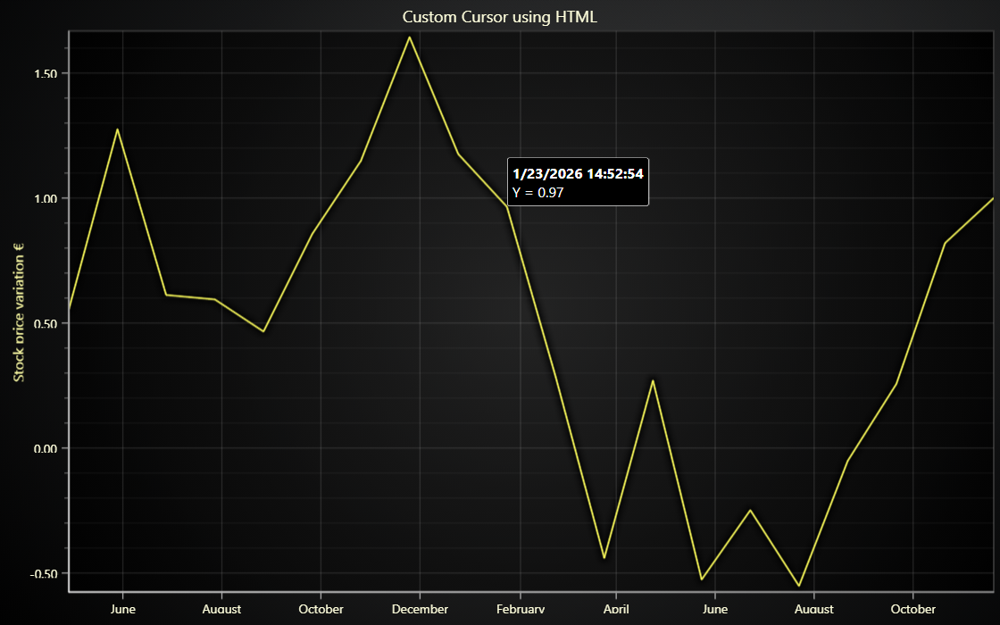

# JavaScript Custom HTML Cursor Chart



This demo application belongs to the set of examples for LightningChart JS, data visualization library for JavaScript.

LightningChart JS is entirely GPU accelerated and performance optimized charting library for presenting massive amounts of data. It offers an easy way of creating sophisticated and interactive charts and adding them to your website or web application.

The demo can be used as an example or a seed project. Local execution requires the following steps:

-   Make sure that relevant version of [Node.js](https://nodejs.org/en/download/) is installed
-   Open the project folder in a terminal:

          npm install              # fetches dependencies
          npm start                # builds an application and starts the development server

-   The application is available at _http://localhost:8080_ in your browser, webpack-dev-server provides hot reload functionality.


## Description

This example serves as an example for creating a custom cursor for XY charts.

Custom cursors can be required for different purposes - like major structural changes or very application specific styling requirements.

If lesser changes to default cursors are required then please see read about different methods of configuring cursor behavior - Features > Cursor section in Developer documentation is a good reference.

All charts expose a simple method: `setCustomCursor` which can be conveniently used to firstly disable the built-in cursor and secondly trigger an automatic callback whenever the cursor should be displayed or hidden, with all information about the pointed data prepared beforehand.

Thanks to this, regardless how you want to display your custom cursor, it is extremely easy to plug it to LCJS.

```ts
ChartXY.setCustomCursor((chart, hit, hits) => {
    // hit : { x, y, series, axisX, axisY, ... }
    // hits contain information of all cursor hits in case of multi series cursors
})
```

In this example, the custom cursor visual is created with dynamically injected `HTML` and `CSS`.

**The same approach could be used for interacting with any UI framework**, idea being that `LCJS` is used for solving the data point and translating the location to the document, where any `HTML` element can be absolute positioned with `left` & `top` style.

The location and visibility of result table is animated with a `CSS` transition.

More custom cursor examples can be found under ["cursor" tag](https://arction.com/lightningchart-js-interactive-examples/search.html?t=cursor) in the _Interactive Examples_ gallery.


## API Links

* [Lightning Chart top reference]
* [Auto cursor modes]
* [Axis tick strategies]
* [UI element builders]
* [UI layout builders]
* [UI backgrounds]
* [UI position origin]
* [Color factory hexadecimal]
* [Solid fill style]
* [Solid line style]
* [Chart XY]
* [Axis XY]


## Support

If you notice an error in the example code, please open an issue on [GitHub][0] repository of the entire example.

Official [API documentation][1] can be found on [LightningChart][2] website.

If the docs and other materials do not solve your problem as well as implementation help is needed, ask on [StackOverflow][3] (tagged lightningchart).

If you think you found a bug in the LightningChart JavaScript library, please contact sales@lightningchart.com.

Direct developer email support can be purchased through a [Support Plan][4] or by contacting sales@lightningchart.com.

[0]: https://github.com/Arction/
[1]: https://lightningchart.com/lightningchart-js-api-documentation/
[2]: https://lightningchart.com
[3]: https://stackoverflow.com/questions/tagged/lightningchart
[4]: https://lightningchart.com/support-services/

© LightningChart Ltd 2009-2022. All rights reserved.


[Lightning Chart top reference]: https://lightningchart.com/js-charts/api-documentation/v8.0.0/interfaces/LightningChart.html
[Auto cursor modes]: https://lightningchart.com/js-charts/api-documentation/v8.0.0/enums/AutoCursorModes.html
[Axis tick strategies]: https://lightningchart.com/js-charts/api-documentation/v8.0.0/variables/AxisTickStrategies.html
[UI element builders]: https://lightningchart.com/js-charts/api-documentation/v8.0.0/variables/UIElementBuilders.html
[UI layout builders]: https://lightningchart.com/js-charts/api-documentation/v8.0.0/variables/UILayoutBuilders.html
[UI backgrounds]: https://lightningchart.com/js-charts/api-documentation/v8.0.0/variables/UIBackgrounds.html
[UI position origin]: https://lightningchart.com/js-charts/api-documentation/v8.0.0/variables/UIOrigins.html
[Color factory hexadecimal]: https://lightningchart.com/js-charts/api-documentation/v8.0.0/functions/ColorHEX.html
[Solid fill style]: https://lightningchart.com/js-charts/api-documentation/v8.0.0/classes/SolidFill.html
[Solid line style]: https://lightningchart.com/js-charts/api-documentation/v8.0.0/classes/SolidLine.html
[Chart XY]: https://lightningchart.com/js-charts/api-documentation/v8.0.0/classes/ChartXY.html
[Axis XY]: https://lightningchart.com/js-charts/api-documentation/v8.0.0/classes/Axis.html

